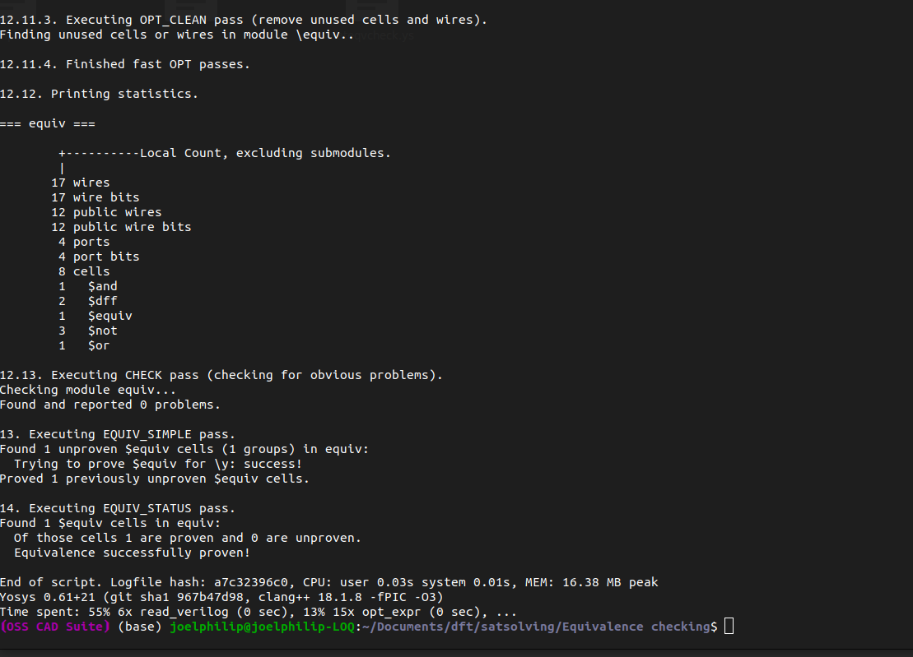
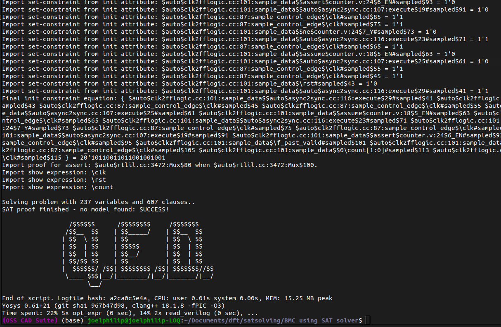
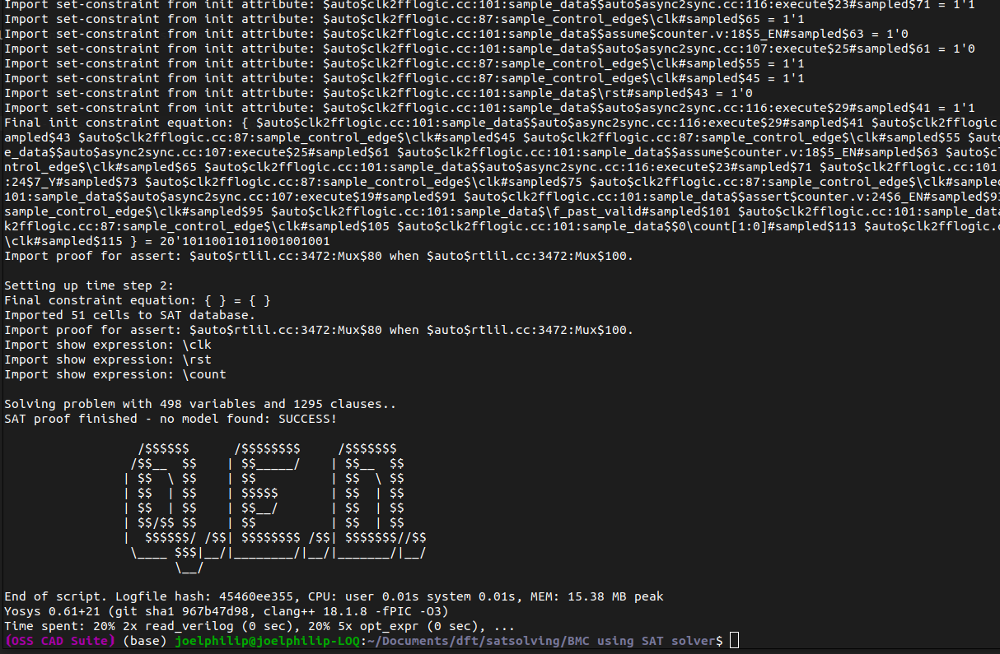
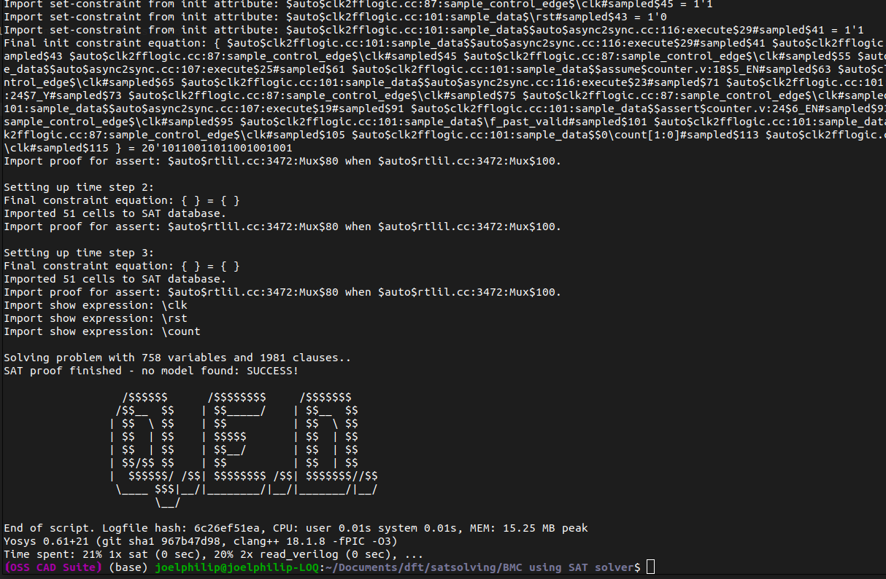
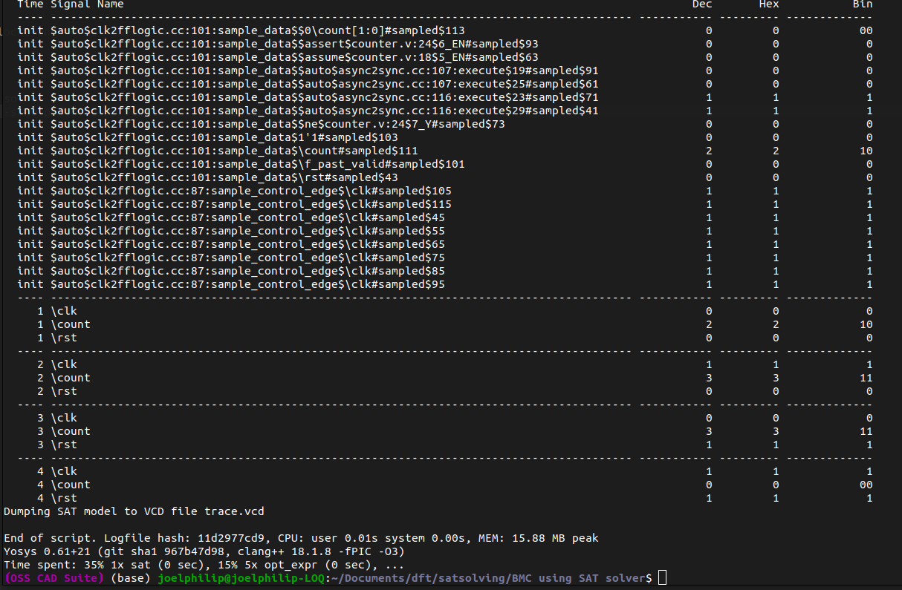
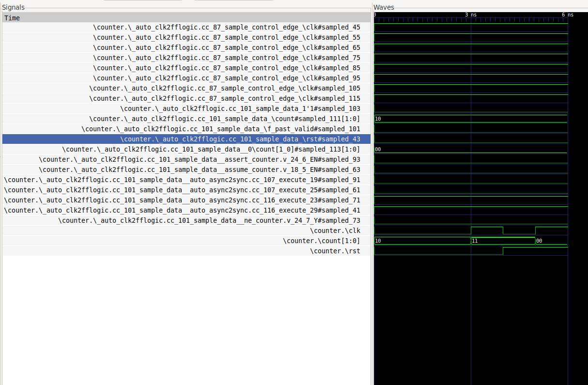
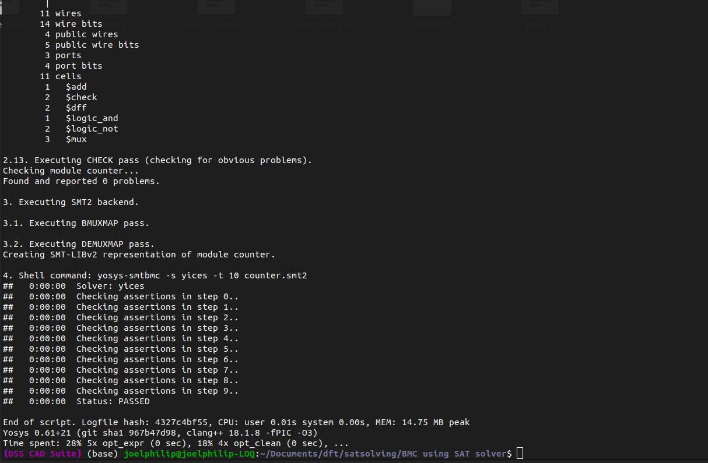
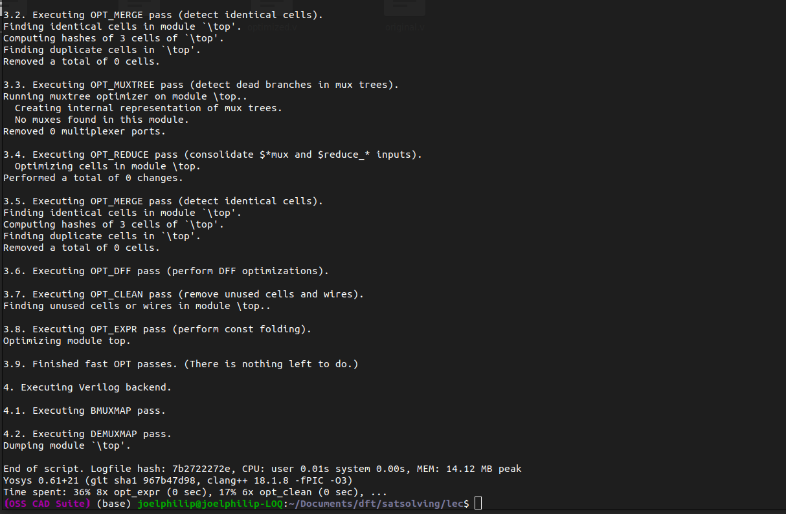
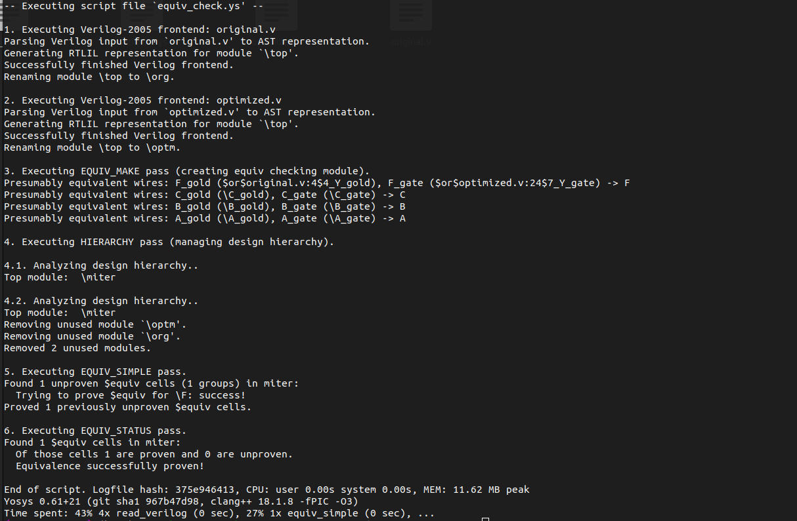

# VLSI Testing and Verification: Formal Verification with Yosys and SAT Solvers

Formal verification of digital hardware is often perceived as a complex domain; however, at its core, it relies on rigorous mathematics to prove that a circuit operates exactly as intended. Instead of relying on exhaustive testbenches to simulate every possible scenario, formal verification translates the hardware design into mathematical equations and utilizes a solver to identify potential flaws. Through this repository, I aim to demonstrate the complete workflow of verifying digital circuits formally ranging from logical equivalence checking to bounded model checking (BMC) using tools provided in the OSS CAD Suite.

Before proceeding to the practical implementation, it is essential to establish a foundational understanding of how this tool flow operates.

---

## Part 1: Tool Flow

Ideally, the formal verification flow is executed in a few distinct phases. First, the system reads the Hardware Description Language (such as Verilog) and synthesizes it logically, without mapping it to a specific physical technology library. Following this, the circuit logic is transformed into pure boolean mathematical representations. Finally, these formulas are submitted to a mathematical solver to formally *prove* or *disprove* specified properties.

To accomplish this, the workflow requires both a frontend processing tool and a backend verification engine.

For the frontend, we utilize **Yosys** (the Open SYnthesis Suite). Yosys acts as the primary translator for the system. It is responsible for parsing the Verilog code, optimizing the logic, and translating the overall design into formal representations, such as SMT2.

For the backend, we rely on verification engines packaged within the Yosys ecosystem. This suite includes Yosys's built-in formal framework (`sat` and `equiv_check`), external scripts like `yosys-smtbmc` for orchestrating Bounded Model Checking, and an integrated tool called **ABC** that manages boolean mapping and logic reductions.

### The Reasoning Engines: SAT and SMT

* **SAT Solvers** (e.g., MiniSAT) handle Boolean Satisfiability. They analyze expansive boolean equations and algebraically determine whether there is *any* valid combination of inputs (1s and 0s) that causes the entire formula to evaluate to "True" (referred to as Satisfiable, or SAT).
* **SMT Solvers** (e.g., Yices or Z3) manage Satisfiability Modulo Theories. These engines extend the capabilities of standard SAT solvers by processing more complex mathematical constraints and evaluating temporal logic over periods of time.

### Mathematical Modeling in Hardware

In the context of formal verification, a mathematical model is an abstract representation of a system's logic and behavior using strict mathematical constraints.

For instance, sequential logic (such as a digital counter) is modeled as a **State Transition System**. It is defined mathematically using a set of all possible states ($S$), the initial starting state ($S_0$), and the transition relation, or next-state logic ($R$). When performing Bounded Model Checking (BMC), the solver takes this transition relation and unrolls it across time. It constructs a comprehensive formula representing step 1, AND step 2, AND step 3, up to a defined bound of $k$ steps.

Another prominent example is the **Miter Circuit** used in Equivalence Checking. When assessing whether two distinct logic circuits behave identically, a miter circuit connects the inputs of both circuits together and feeds their respective outputs into an XOR gate. The mathematical model then poses a single question to the SAT solver: *Is there any possible input combination that causes this XOR gate to output a 1?*

### Interpreting the Solver's Output

Depending on the verification objective, the solver's output carries distinct implications:

* **During Equivalence Checking:**
    * **UNSAT (Unsatisfiable):** This indicates that the XOR gate can never output a 1. The two circuits are perfectly **equivalent**.
    * **SAT (Satisfiable):** The solver identified an input combination that causes the outputs to differ. The circuits are **not equivalent**, and the solver generates a counter-example detailing the point of failure.
* **During Property Checking (BMC):**
    * **SAT (Satisfiable):** The solver successfully reached the invalid state it was instructed to avoid. The safety property **fails**, yielding a trace that visualizes the error path.
    * **UNSAT (Unsatisfiable):** The solver was unable to reach the invalid state within the designated bound of $k$ steps. The property successfully **holds** for that timeframe.

---

## Part 2: Practical Implementation and Results

Having established the theoretical framework, we can now examine how these principles apply to the four primary tasks of the assignment.

### 1: Equivalence Checking

**The Objective:** Given a reference circuit (`y <= a & b;`) and a modified implementation circuit (`y <= ~(~a | ~b);`), the goal is to prove that they are functionally identical using a miter circuit and SAT-based checking.

**Theoretical Work: Modeling and Miter Construction**
To formally check sequential equivalence, we mathematically model both circuits as state transition systems:
* **Circuit A (Ref) Transition System ($T_A$):** $y_{A_{k+1}} = (a_k \land b_k)$
* **Circuit B (Impl) Transition System ($T_B$):** $y_{B_{k+1}} = \neg(\neg a_k \lor \neg b_k)$

*Constructing the Miter Circuit:*
A miter circuit ties the inputs of both systems together ($a_A = a_B$, $b_A = b_B$) and feeds their outputs into an XOR gate to check for inequality. The SAT solver attempts to satisfy the equation: $Miter_{output} = (y_A \oplus y_B)$.

By De Morgan's laws, $\neg(\neg a \lor \neg b)$ is mathematically identical to $(a \land b)$. Therefore, $(y_A \oplus y_B)$ will always evaluate to $0$. The SAT solver will return **UNSAT**, formally proving that no combination of inputs can cause the circuits to behave differently.

**Simulation:**
In the `Equivalence checking/` directory, three files were established: `ref.v` (the reference design), `impl.v` (the implementation), and `sateqvcheck.ys` (the execution script).

The process was executed using the following Yosys commands:

* `read_verilog` is utilized to load both HDL files into the environment.
* `prep -auto-top` synthesizes the basic structures and automatically identifies the top-level module.
* `flatten` and `techmap` are used to collapse the design hierarchy and reduce the logic into single bit-level representations.
* Prior to invoking the SAT solver, `abc -fast` is executed. This utilizes the ABC synthesis tool to map and extensively simplify the boolean logic.
* The core of the process utilizes `equiv_make <ref> <impl> <equiv_miter>`. This command constructs the Miter Circuit by linking the inputs of both modules and comparing their outputs.
* Finally, `equiv_simple` performs logic sweeps to mathematically prove that the miter circuit's output can never evaluate to true.

**The Result:** The solver returned UNSAT, formally proving that the two circuits are perfectly equivalent.

---

### 2: Bounded Model Checking (Safety Property)

**The Objective:** To analyze a 2-bit counter and ensure it never reaches the state `11`. This represents a standard "Safety" property guaranteeing that an invalid condition never occurs.

**Theoretical Work: Applying BMC and Constructing the SAT Formula**
Bounded Model Checking (BMC) unrolls the hardware design for $k$ clock cycles into a massive Boolean equation. The SAT solver asks: *"Is there any combination of inputs over $k$ cycles that makes the safety property FALSE?"*

Let $S_k$ be the state of the counter `count` at clock cycle $k$. Let $r_k$ be the state of `rst`.
1. **Initial State ($I$):** We assume the system starts in reset. $I(S_0, r_0) = (r_0 = 1) \land (S_0 = 0)$
2. **Transition Relation ($T$):** The counter logic moving from cycle $k$ to $k+1$. $T(S_k, r_{k+1}, S_{k+1}) = (r_{k+1} = 1 \implies S_{k+1} = 0) \land (r_{k+1} = 0 \implies S_{k+1} = (S_k + 1) \bmod 4)$
3. **Property Violation ($V$):** The safety property is that the counter should never reach state `2'b11` (decimal 3). The SAT solver looks for a violation: $V(S_k) = (S_k = 3)$

*The Complete SAT Formula ($F_k$):*
$$F_k = I(S_0, r_0) \land \left( \bigwedge_{i=0}^{k-1} T(S_i, r_{i+1}, S_{i+1}) \right) \land V(S_k)$$

*Answer to "In Verilog code have you added anything for property check?":*
Yes. To translate this mathematics into code, SystemVerilog Assertions (SVA) were added to the Verilog file inside an `` `ifdef FORMAL `` block. Specifically, an `assume(rst)` statement was added to satisfy the Initial State ($I$), and an `assert(count != 2'b11)` statement was added to define the safety property constraint.

**Simulation:**
In the `BMC using SAT solver/` directory, the counter logic was written in `counter.v`, with the aforementioned assertions injected directly into the code. The verification was managed via the `verify.ys` script.

The command breakdown is as follows:

* `read_verilog -formal counter.v`: The `-formal` flag is essential, as it instructs Yosys to process and retain the `assert()` and `assume()` statements.
* `async2sync` and `clk2fflogic`: Because SAT solvers do not natively interpret temporal clock edges, these commands translate the dynamic sequential clock transitions (`posedge clk`) into formal, SAT-compatible combinational logic.
* `sat -seq 4 -prove-asserts -dump_vcd trace.vcd counter`: This invokes the internal SAT solver, instructing it to unroll the logic evaluation across 4 time steps.

**The Result:** Because a standard 2-bit counter naturally increments to `11`, the SAT solver systematically identified a path to break the safety rule. It evaluated cycles 1, 2, 3, and 4 iteratively. Upon determining the property was SAT (Satisfiable), it generated a counter-example trace.

Viewing the resulting `trace.vcd` file in GTKWave visually demonstrates the exact cycle where the failure occurs:

---

### 3: Bounded Model Checking (Liveness Property)

**The Objective:** Using the same 2-bit counter, the next goal is to verify a "Liveness" property: proving that *eventually*, the counter returns to `00`. While safety properties ensure a negative outcome is avoided, liveness properties guarantee a positive outcome eventually occurs.

Within the same directory, the code was updated in `lively_counter.v` to include a specific temporal check.

Because standard SAT solvers lack the capacity to efficiently prove infinite loops or eventual conditions, the approach in `lively_verify.ys` required modification:

* `write_smt2 -wires counter.smt2`: This command exports the verified design into a mathematical SMT-LIBv2 format, which is engineered to handle advanced temporal logic.
* Subsequently, executed from the standard Linux terminal, the command `yosys-smtbmc -s yices -t 10 counter.smt2` interfaces with the **Yices** external SMT solver, directing it to perform Bounded Model Checking over a span of 10 steps.

**The Result:** The Yices solver mathematically proved that the counter will consistently return to `00`, yielding a successful "PASSED" output.

---

### 4: Optimization and Equivalence Checking

**The Objective:** The final task involves applying automatic logic optimization to a segment of unoptimized RTL logic specifically `F = (A & B) | (A & B & C)` and subsequently proving that the newly reduced circuit is functionally equivalent to the original design.

In the `lec/` directory, the base logic was defined in `original.v`. The process was divided into two scripts: `optimize.ys` (Part A) and `equiv_check.ys` (Part B).

**Part A: Logic Optimization**

* The process relied on the primary `opt` command. Yosys successfully identified that the `(A & B & C)` segment is mathematically redundant based on boolean absorption laws (as `A & B` sufficiently covers the condition). Consequently, the unnecessary logic gates were removed.
* The command `write_verilog optimized.v` was then utilized to export this minimized circuit into an independent file.

**Part B: Equivalence Checking**
To ensure that the optimization process did not alter the circuit's functionality, the miter approach was employed once more.

* `equiv_make org optm miter`: This command logically connected the original (`org`) and optimized (`optm`) modules via an XOR comparison within a testing structure designated as `miter`.
* `hierarchy -top miter`: This designated the miter structure as the primary root node for evaluation.
* `equiv_simple`: This executed the necessary structural and SAT sweeps to evaluate the designs for any discrepancies.
* `equiv_status -assert`: This aggregated the final results. The `-assert` flag acts as a failsafe mechanism, immediately halting the build process if the designs are found to be non-equivalent.

**The Result:** The final validation concluded successfully. The SAT solver confirmed that the optimized circuit exhibits identical behavior to the original design, thereby proving the optimization was effective without compromising structural functionality.

